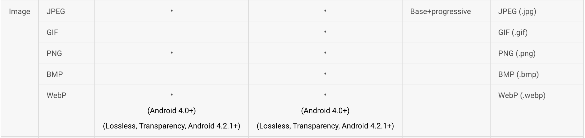

之前翻译过一篇关于如何缩小apk文件大小的文章，里边提到了使用压缩工具对图片进行无损压缩，在实际测试中也确实有效果，但这还不是最好的方式，最近了解到了WebP(早就有了，怪自己孤陋寡闻啊)，一种新的图片格式，比jepg、png更节省空间。

### WebP简介
WebP（发音weppy）最初在2010年发布，是一种同时提供了有损压缩与无损压缩的图片文件格式，目标是减少文件大小，但达到和JPEG格式相同的图片质量。根据Google较早的测试，WebP的无损压缩比网络上找到的PNG档少了45％的文件大小，即使这些PNG档在使用pngcrush和PNGOUT处理过，WebP还是可以减少28％的文件大小。

### Android与WebP
在Android 4.0之后，Android已经对WebP文件做了默认的支持，当然如果想在Android 4.0之前使用WebP还是有相应办法的，本文不做讨论，我也不认为这值得讨论，4.0之前还是尽早淘汰掉吧。

### WebP工具在Mac Os下的安装

#### 方式一：使用MacPorts安装

1.到此网站[链接](http://distfiles.macports.org/MacPorts/)下载与系统版本对应的MacPorts，安装MacPorts之前需要安装Xcode.

2.按照此文档对MacPorts进行安装，[链接](https://guide.macports.org/#installing.macports)，我选择的是下载.pkg文件进行安装的。

但我在安装的过程中卡住了，这个可能是由于GFW的原因，网上说安装时最好断网。

3.安装完成后更新：`sudo port -v selfupdate。`。

4.然后安装libwebp，`sudo port install webp`

#### 方式二：使用Homebrew

1.安装Homebrew，[http://brew.sh/index_zh-cn.html](http://brew.sh/index_zh-cn.html)

2.安装完成后，用如下命令安装libwebp，`brew install webp`

### 使用
使用 cwebp 将 JPEG 或 PNG 图像转换成 WebP 格式。

`cwebp [options] -q quality input.jpg -o output.webp`

使用 dwebp 实用程序将 WebP 图像转换回 PNG、PAM、PPM 或 PGM 图像。

`dwebp input_file.webp [options] [-o output_file]`

转换后的.webp文件，同.png在Android中的用法一样。

	ImageView imageView = (ImageView)findViewById(R.id.iv);
	imageView.setImageResource(R.drawable.output);
